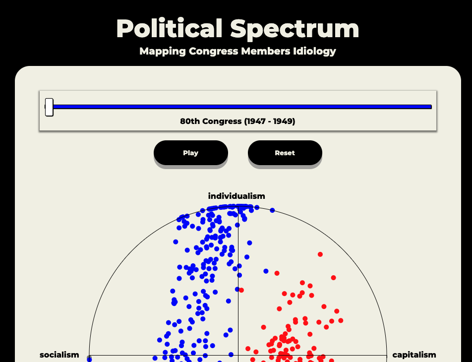
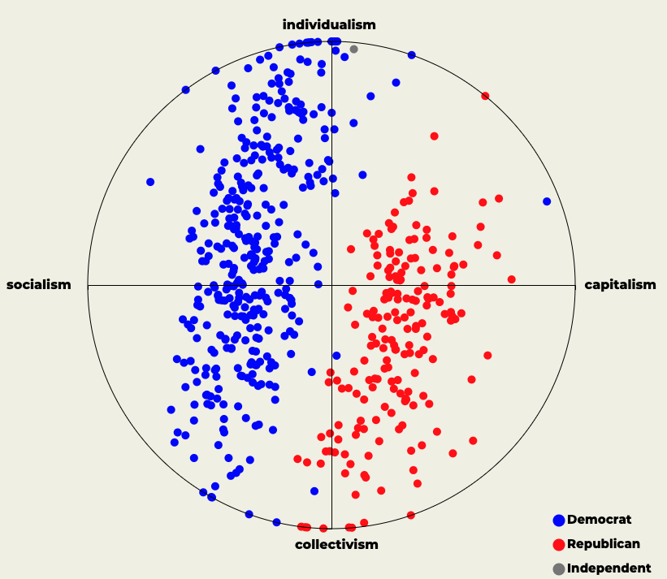
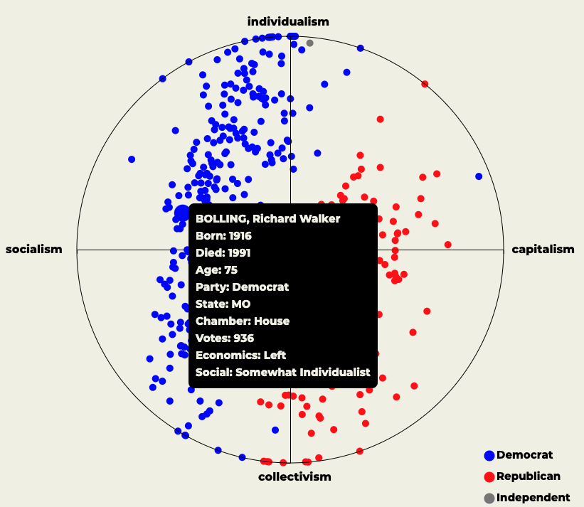
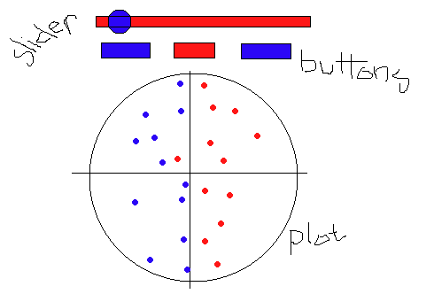

# Political Spectrum

<a target="_blank"><h2>Live Site</h2></a>

## Background and Overview

### Motivation

* One of my greatest interests has always been exploring the evolution of politics throughout  human history. I've come to realize that over the past few decades, Congress has slowly become further divided on issues, ideology, and voting patterns. I wanted to see if this was truly the case by building a tool that two dimensionally plots each Congress Member's ideology to visualize whether or not Congress is truly becoming more divided. I realized that the internet has many resources demonstrating how and what each member voted on, but there was really no "one stop shop" to visualize all of this without sifting through mounds of data.

### Overview

* Political Spectrum plots every Congress Member, including the House and the Senate, based on two seperate metrics: the first being economic ideology, which represents traditional political economics, and the second being social welfare, which includes race, gender, immigration, and other policies not specifically tied to economics. Each member is then assigned 2 cooridnate values ranging from -1 to 1 as a result of both ideology and voting history. These numbers are then plotted on a graph in accordance with each Congressional term from 1947 to 2021. Over time, one can visualize how further divided Congress has become

## Architecture and Technologies

* Vanilla JS for overall structure and interactivity
* D3.js to render the plot and graph the Congress members
* CSS for styling
* Manual excel data manipulation to format the data files accordingly
* Webpack to bundle scripts into a single source

## MVP Features

### Congressional Plot

* Leveraged D3 to create a circular scatter plot to map each member of Congress. The X and Y axis both range from -1 to 1, representing the metrics noted above, respectively.
* Harnessed external data figures demonstrating members' ideology and history. This data was manipulated relative to the axis above in order to standardize and scale
* The following is a plot demonstrating the 95th Congress of the United States, which shows minor division between Democrats and Republicans

### Interactivity

* A dynamic slider allows users to change the plotted Congressional term to visualize a point-in-time representation
* Hover over each data point to see who the Congress Member is
* If a specifc point interests you, click on it to view more information about the Congress Member, such a s bio data as well as political stances

### Playback

* Play and Reset buttons allow users to automate the slider so that they may visualize the overall evolution of congress over time

## Wireframe

## Timeline
* Day 1: Source data from multiple outlets
* Day 2: Create the scatter plot and add points
* Day 3: Implement interactivty
* Day 4: Add playback options
* Day 5: Style with CSS